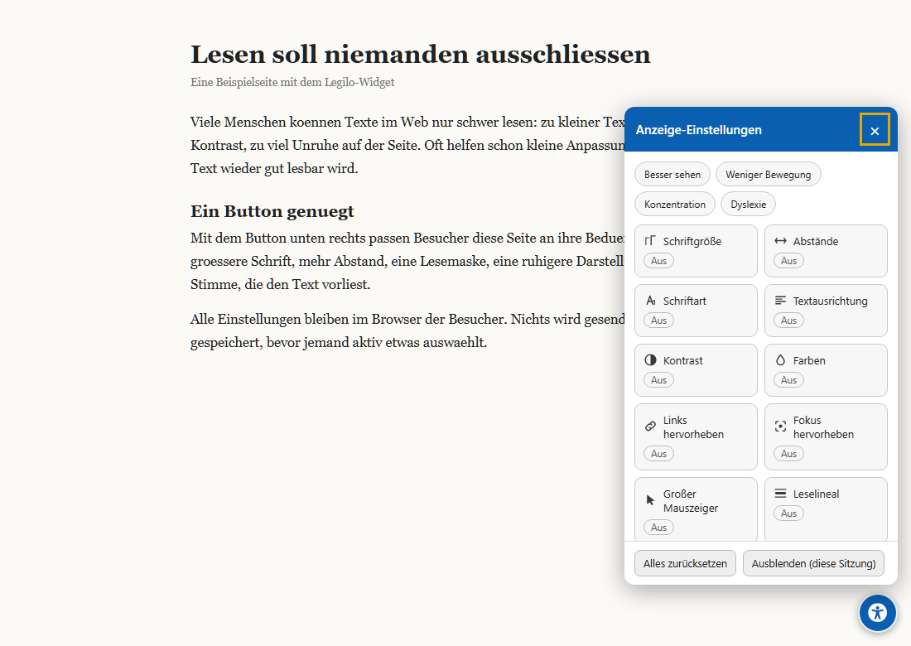

<p align="center"></p>

# Legilo

Free accessibility widget, honestly built as a reading aid. One script tag gives
your visitors a button to adjust contrast, font size, spacing, a dyslexia font,
a reading mask, read-aloud with live word highlighting and more - in 37
languages with automatic detection, RTL included.

**Configurator: https://legilo.eu** &nbsp;|&nbsp; **Developer reference: https://legilo.eu/api**

**0** trackers, **0** cookies, **0** dependencies, **1** script tag. MIT
licensed, free forever, commercial use included.

<p align="center"></p>

## Honest positioning

No widget makes a website accessible. None, from any vendor, and Legilo is no
exception: conformance with WCAG, EN 301 549 or national accessibility laws
(EAA/BFSG/BaFG) is created in your website's source code, not by a widget. What
a widget can honestly do is make reading easier for visitors - that is exactly
what Legilo does, and we will never market it as anything else. For the part a
widget cannot do, the project page includes a free website check (Lighthouse)
that shows where the real barriers are.

## Quick start

Configure at https://legilo.eu and paste one line before `</body>`:

```html
<script src="https://legilo.eu/legilo.js?color=0b5fb0&lang=auto" defer></script>
```

Prefer self-hosting? Download a ready-made `legilo.js` with your configuration
and the dyslexia font baked in - it runs entirely on your own server, with zero
requests to legilo.eu. WordPress users grab the wrapper plugin from the
WordPress tab in the configurator (source in `wordpress/legilo/`).

Everything else is documented at **https://legilo.eu/api**: all URL parameters,
`data-*` attributes and `window.LegiloConfig`, the JavaScript API
(`open/close/toggle/reset/set/get/features/destroy`), theming via `::part()`
([template](docs/legilo-theme.css)), the `css=none` expert mode with its CSS
skeleton, and CSP notes.

## What's inside

18 functions and 4 one-click profiles in an accessible, non-modal panel
(Esc closes, live announcements, 44 px touch targets, print-safe). Page effects
are applied through a single injected `<style>` element - Legilo never rewrites
your markup and never guesses ARIA attributes or alt texts. Visitor settings
live in one `localStorage` key, written only after actual interaction;
read-aloud never autostarts. All of it is verifiable in `widget/widget.js`,
a single readable file, not a minified blob.

## Self-hosting the whole project

Plain PHP, no dependencies, no build step. Requirements: Apache with
mod_rewrite and mod_headers (or equivalent rewrites).

```
index.php        router + JS generator (ETag cache, minify, sitemap, robots)
config.php       single source of truth: option schema, languages, brand
generate.php     project page + configurator (11 languages)
api.php          developer reference (/api)
imprint.php      legal notice
translations/    configurator UI languages (one PHP file per language)
widget/          widget template + 37 widget language files
assets/          OpenDyslexic font (SIL OFL 1.1), cursor, favicon, social image
wordpress/       WordPress wrapper plugin
```

## License

MIT (see `LICENSE`). The OpenDyslexic font is licensed under the SIL Open Font
License 1.1 - `assets/fonts/OFL.txt` must stay with the font files.
